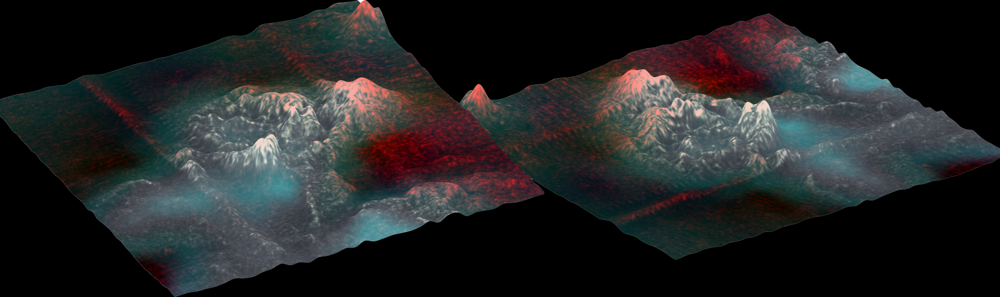

# Cassini VIMS & RADAR Analysis:
# Automatic processing of SAR/VIMS data that acquired from Cassini mission on Titan

The repo contains scripts for automatic processing of Cassini SAR/VIMS with the use of USGS' Integrated Software for Imagers and Spectrometers (ISIS3) and MatLab. There are also some MatLab files to make 3D approximations and videos of the terrain.

### Sotra Patera 3D terrain approximation with false-coloring depending on VIMS data 
### (Click on the image to see the video)

### VIMS and SAR processing on Tortula Facula

### SAR Despecle filtering and DN false-coloring on Menrva Crater

### SAR analysis on Kraken Mare

