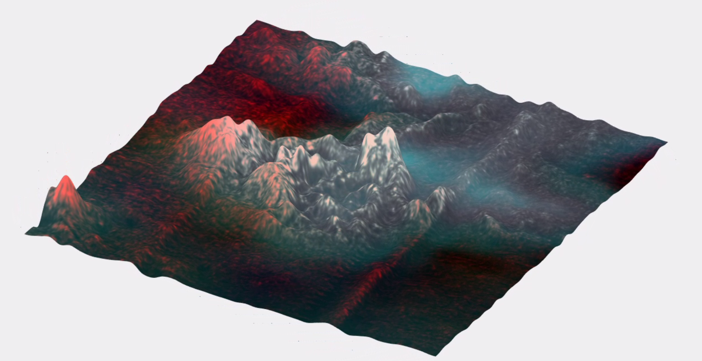

# Cassini_SAR_VIMS_Analysis
Automatic processing of Cassini SAR/VIMS data

Scripts for automatic processing of Cassini SAR/VIMS with the use of USGS' Integrated Software for Imagers and Spectrometers (ISIS3) and MatLab. There are also some MatLab files to make 3D approximations and videos of the terain like the following one (Click on the image to see the video) 

